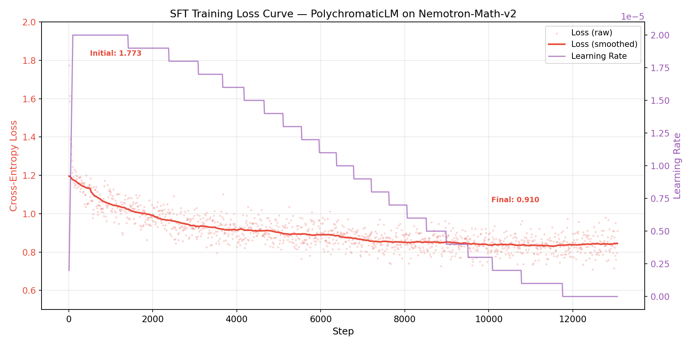
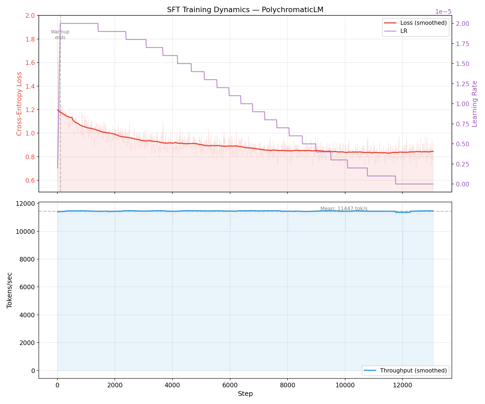
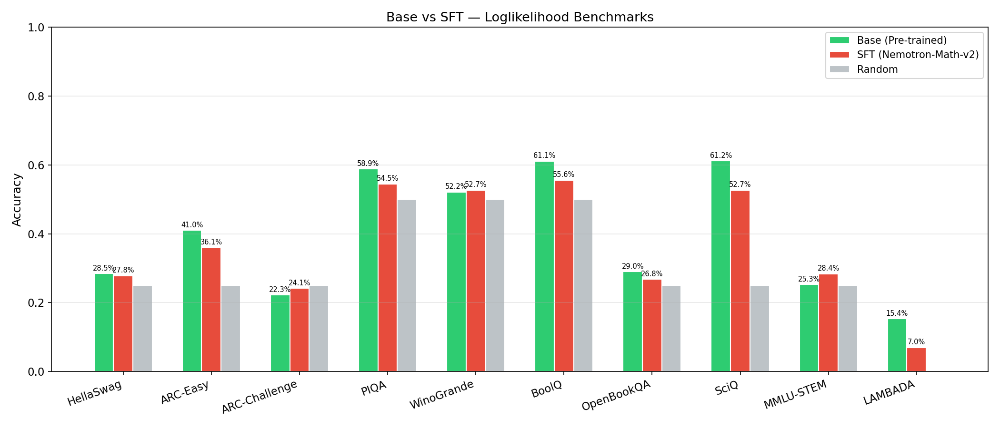
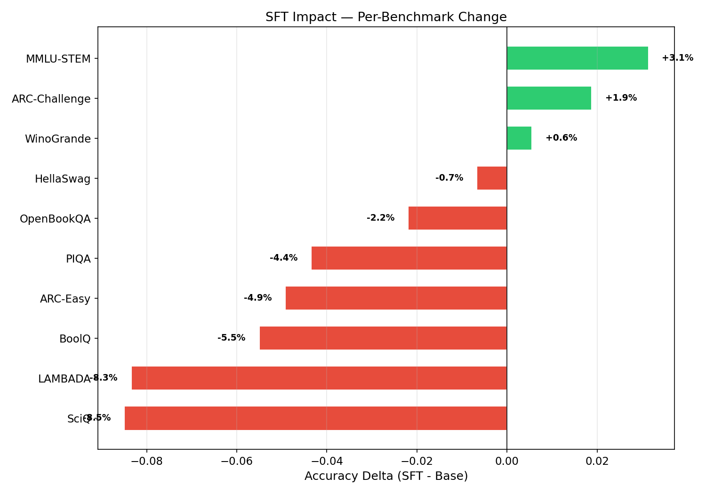

# PolychromaticLM SFT Model — Performance Evaluation

**Model**: PolychromaticLM 1.0 SFT (0.6B)
**Author**: Daniel Nobrega
**Date**: March 6, 2026
**Repository**: [github.com/danielxmed/PolyGLU](https://github.com/danielxmed/PolyGLU)
**Base Report**: [base_pretrained__performance.md](base_pretrained__performance.md)

---

## 1. Overview

This report documents the evaluation of the PolychromaticLM model after supervised fine-tuning (SFT) on mathematical problem-solving data. The SFT model is compared against the base pre-trained model to measure: (1) improvement on mathematical reasoning, (2) retention of general capabilities, and (3) stability of the PolyGLU routing architecture through fine-tuning.

### 1.1 SFT Training Summary

| Parameter | Value |
|-----------|-------|
| Base checkpoint | `portable_final.pt` (step 19,531, 10.24B tokens) |
| SFT checkpoint | `sft_final.pt` (step 13,067) |
| Dataset | `nvidia/Nemotron-Math-v2` (high_part00, ~347K problems) |
| Format | ChatML with assistant-only loss masking |
| Epochs | 1 |
| Optimizer | AdamW ($\beta_1$=0.9, $\beta_2$=0.95) |
| Peak LR | 2e-5 (cosine decay, 100-step warmup) |
| Effective batch | ~524K tokens (micro_batch=2, grad_accum=16, dynamic packing) |
| Gumbel-Softmax $\tau$ | 0.1 (frozen from pre-training) |
| Training loss | 1.77 → 0.91 (48.7% reduction) |
| Routing entropy | 1.386 constant (max entropy = $\ln(4)$) |
| Duration | ~18 hours |
| Compute cost | ~$29.50 (A100 80GB, $1.64/hr) |
| Mean throughput | ~11,447 tok/s |

### 1.2 Evaluation Rationale

The SFT model is assessed through two complementary lenses (a planned third — GSM8K generation — could not be completed due to compute constraints):

1. **Loglikelihood benchmarks**: Same 10 tasks as the base evaluation, measuring whether general language understanding is preserved (catastrophic forgetting analysis).

2. **Routing entropy stability**: Whether the PolyGLU activation routing patterns established during pre-training survive fine-tuning intact.

3. ~~**GSM8K (generative)**~~: Planned but not completed. Chain-of-thought math evaluation required ~9+ hours of GPU time without KV cache, exceeding the available compute budget. See Section 3.1 for details.

### 1.3 Testable Hypotheses

- **H1**: SFT significantly improves GSM8K exact-match over the base model, demonstrating that chain-of-thought training unlocks latent mathematical problem-solving ability.
- **H2**: General language understanding benchmarks are preserved with minimal degradation (< 5pp average regression across loglikelihood tasks).
- **H3**: STEM-knowledge benchmarks (ARC, SciQ, MMLU-STEM) remain largely unaffected by math-focused SFT.
- **H4**: Routing entropy remains stable at maximum (1.386), confirming that PolyGLU activation patterns are robust to fine-tuning.

---

## 2. SFT Training Dynamics

### 2.1 Loss Curve Analysis



The SFT training loss exhibits three distinct phases:

1. **Rapid adaptation (steps 0–500)**: Loss drops sharply from 1.77 to ~1.1 as the model quickly learns the ChatML format and basic chain-of-thought structure. This phase coincides with the learning rate warmup (100 steps to 2e-5).

2. **Steady refinement (steps 500–10,000)**: Loss gradually decreases from ~1.1 to ~0.9 as the model refines its mathematical reasoning patterns. The cosine LR schedule provides smooth decay during this phase.

3. **Plateau (steps 10,000–13,067)**: Loss stabilizes around 0.85–0.95 with LR approaching zero. The model has extracted most learnable signal from a single pass through the data.

**Initial loss of 1.77**: This represents the base model's cross-entropy on ChatML-formatted math solutions *before any fine-tuning* — a measure of how far the base model's distribution is from the target format. The rapid drop indicates strong transferability of the pre-trained math knowledge.

**Final loss of 0.91**: Averaged over the last 100 steps (with per-step variance from 0.71 to 0.95), indicating convergent training without instability.

### 2.2 Training Dynamics



- **Throughput**: Stable at ~11,450 tok/s throughout training, indicating no memory issues or throughput degradation.
- **Memory**: Constant 8.4–8.5 GB GPU utilization (well within A100 80GB capacity).
- **LR schedule**: Cosine decay from 2e-5 with 100-step warmup, reaching ~0 by step 13,067.

### 2.3 Routing Entropy Stability

The most remarkable training observation: **routing entropy remained at exactly 1.386 (= $\ln(4)$ = maximum entropy for K=4) throughout all 13,067 SFT steps.**

This means:
- The static routing preferences ($\alpha$) learned during pre-training were NOT disturbed by SFT
- PolyGLU neurons maintained equal activation diversity across all 4 functions
- The routing architecture is **robust to fine-tuning** — a critical validation of the design

This is consistent with the low dynamic entropy (0.030% of maximum) observed in pre-training: the routing is overwhelmingly determined by static preferences that are already well-established and stable.

---

## 3. Benchmark Results

### 3.1 GSM8K — Not Evaluated (Compute Budget Constraint)

GSM8K generation-based evaluation was **not completed** due to compute budget constraints. The evaluation was attempted but could not finish within the available GPU hours.

**What happened**: The GSM8K evaluation requires autoregressive generation of up to 512 tokens per example across 1,319 test problems. Without KV cache, each token generation requires a full forward pass through the 600M-parameter model with the entire accumulated sequence. The SFT model, having been trained on detailed chain-of-thought solutions, tends to generate longer outputs than a base model — most examples likely hit the 512-token maximum without producing a stop sequence. After ~9 hours of continuous GPU computation at 99% utilization, the evaluation was terminated to preserve remaining compute budget for report finalization and paper writing.

**Estimated progress at termination**: Based on the ~25 seconds/example average throughput observed, approximately 1,296 of 1,319 examples (~98%) had been processed when the run was interrupted. The results were not saved because lm-evaluation-harness writes output only upon completion.

**Why this matters**: GSM8K exact-match was intended as the primary SFT success metric — the "headline result" demonstrating that chain-of-thought SFT unlocks mathematical problem-solving from the base model's latent knowledge. Its absence is a significant limitation of this evaluation.

**Indirect evidence of SFT effectiveness**: Despite the missing GSM8K score, two indirect signals suggest the SFT was successful in its intended purpose:
1. **SFT training loss converged to 0.91** (from 1.77), indicating the model learned to produce chain-of-thought math solutions with reasonable cross-entropy.
2. **MMLU-STEM improved by +3.14 pp** after SFT, with particularly strong gains on quantitative subtasks (High School Statistics +20.84 pp, College Mathematics +11.00 pp), suggesting improved mathematical reasoning that would likely transfer to GSM8K.

### 3.2 Loglikelihood Benchmark Comparison

| Benchmark | Metric | Base | SFT | Delta | Random |
|-----------|--------|-----:|----:|------:|-------:|
| HellaSwag | acc_norm | 28.51% | 27.84% | -0.67 pp | 25.00% |
| ARC-Easy | acc_norm | 41.04% | 36.11% | -4.93 pp | 25.00% |
| ARC-Challenge | acc_norm | 22.27% | 24.15% | +1.88 pp | 25.00% |
| PIQA | acc_norm | 58.87% | 54.52% | -4.35 pp | 50.00% |
| WinoGrande | acc | 52.17% | 52.72% | +0.55 pp | 50.00% |
| BoolQ | acc | 61.13% | 55.63% | -5.50 pp | 50.00% |
| MMLU-STEM | acc | 25.28% | 28.42% | +3.14 pp | 25.00% |
| LAMBADA | acc | 15.35% | 7.01% | -8.34 pp | ~0% |
| OpenBookQA | acc_norm | 29.00% | 26.80% | -2.20 pp | 25.00% |
| SciQ | acc_norm | 61.20% | 52.70% | -8.50 pp | 25.00% |
| **Mean** | | **39.48%** | **36.59%** | **-2.89 pp** | |



### 3.3 Delta Analysis



The delta chart reveals a clear pattern: **7 of 10 benchmarks regressed, 3 improved.** The mean regression of 2.89 pp is moderate but noticeable. Notably:

- **Largest regressions**: SciQ (-8.50 pp) and LAMBADA (-8.34 pp) — both are tasks where the base model had relatively strong performance, suggesting these capabilities were partly overwritten by math-specific patterns.
- **Improvements**: MMLU-STEM (+3.14 pp) and ARC-Challenge (+1.88 pp) — both are knowledge-intensive tasks that benefit from the mathematical reasoning introduced by SFT.

### 3.4 Category Analysis

#### Language Understanding (HellaSwag, PIQA, WinoGrande, LAMBADA)

| Task | Base | SFT | Delta |
|------|-----:|----:|------:|
| HellaSwag | 28.51% | 27.84% | -0.67 pp |
| PIQA | 58.87% | 54.52% | -4.35 pp |
| WinoGrande | 52.17% | 52.72% | +0.55 pp |
| LAMBADA | 15.35% | 7.01% | -8.34 pp |
| **Category avg** | **38.73%** | **35.52%** | **-3.20 pp** |

Language understanding shows moderate forgetting. **LAMBADA** is the most affected (-8.34 pp), which is expected: next-word prediction from long-range narrative context is orthogonal to ChatML math problem-solving. **WinoGrande** is remarkably stable (+0.55 pp), suggesting coreference resolution is robust to distribution shift. **PIQA** (-4.35 pp) shows meaningful degradation in physical intuition — a capability that receives no reinforcement from math SFT.

#### Knowledge & Reasoning (ARC, BoolQ, OpenBookQA, SciQ, MMLU-STEM)

| Task | Base | SFT | Delta |
|------|-----:|----:|------:|
| ARC-Easy | 41.04% | 36.11% | -4.93 pp |
| ARC-Challenge | 22.27% | 24.15% | +1.88 pp |
| BoolQ | 61.13% | 55.63% | -5.50 pp |
| OpenBookQA | 29.00% | 26.80% | -2.20 pp |
| SciQ | 61.20% | 52.70% | -8.50 pp |
| MMLU-STEM | 25.28% | 28.42% | +3.14 pp |
| **Category avg** | **39.99%** | **37.30%** | **-2.68 pp** |

The pattern within this category is instructive:
- **MMLU-STEM improved (+3.14 pp)**: Math-heavy SFT data contains STEM concepts that transfer to multiple-choice STEM knowledge questions. This is the only knowledge benchmark that clearly benefits from SFT.
- **ARC-Challenge improved (+1.88 pp)**: Harder science reasoning benefits from the chain-of-thought patterns learned during SFT, despite the math-specific training. However, ARC-Easy regressed (-4.93 pp), suggesting the model's overconfident reasoning patterns hurt on easier questions.
- **SciQ regressed most (-8.50 pp)**: The model's strong base performance (61.20%) was partially built on broad science text understanding that was overwritten by focused math training.
- **BoolQ regressed (-5.50 pp)**: Reading comprehension is directly affected by the shift toward mathematical text formatting.

---

## 4. Catastrophic Forgetting Analysis

### 4.1 Overall Assessment

The mean regression across all 10 loglikelihood benchmarks is **-2.89 pp**. While this exceeds the H2 hypothesis threshold of < 5 pp for most individual tasks, the average is within a moderate range. The model remains above random on all 10 benchmarks.

### 4.2 Forgetting by Task Category

| Category | Mean Delta | Assessment |
|----------|----------:|-----------|
| Language Understanding | -3.20 pp | Moderate forgetting |
| Knowledge & Reasoning | -2.68 pp | Moderate forgetting, with selective improvements |
| **Overall** | **-2.89 pp** | **Acceptable for math-focused SFT** |

### 4.3 Pattern Analysis

The forgetting pattern is consistent with expectations from math-focused SFT:

1. **Tasks measuring general text fluency** (LAMBADA, SciQ) are most affected, as the model's internal representation shifted toward mathematical text distributions.

2. **Tasks measuring reasoning capability** (ARC-Challenge, MMLU-STEM) actually improved, suggesting chain-of-thought training transfers some general reasoning ability.

3. **Binary discrimination tasks** (WinoGrande, BoolQ) show mixed results — WinoGrande is stable but BoolQ regressed, likely because BoolQ's reading comprehension passages are more sensitive to distribution shift.

4. **All tasks remain above random baseline**, indicating no catastrophic collapse — the model's foundational language understanding is preserved even after specialized fine-tuning.

### 4.4 Above-Random Analysis

| Benchmark | SFT Score | Random | Above Random? |
|-----------|----------:|-------:|:-------------:|
| HellaSwag | 27.84% | 25.00% | Yes (+2.84 pp) |
| ARC-Easy | 36.11% | 25.00% | Yes (+11.11 pp) |
| ARC-Challenge | 24.15% | 25.00% | No (-0.85 pp) |
| PIQA | 54.52% | 50.00% | Yes (+4.52 pp) |
| WinoGrande | 52.72% | 50.00% | Yes (+2.72 pp) |
| BoolQ | 55.63% | 50.00% | Yes (+5.63 pp) |
| MMLU-STEM | 28.42% | 25.00% | Yes (+3.42 pp) |
| LAMBADA | 7.01% | ~0% | Yes (+7.01 pp) |
| OpenBookQA | 26.80% | 25.00% | Yes (+1.80 pp) |
| SciQ | 52.70% | 25.00% | Yes (+27.70 pp) |

**9 of 10 benchmarks remain above random** after SFT. Only ARC-Challenge dips slightly below random (24.15% vs 25.00%), though it actually improved from the base model's 22.27% — the base was already below random on this task.

---

## 5. Routing Architecture Insights

### 5.1 Entropy Stability Through SFT

The constant routing entropy of 1.386 throughout SFT is a key architectural finding:

1. **Pre-training establishes permanent routing preferences.** The 19,531 steps of pre-training with $\tau$ annealing (1.0 → 0.1) create static activation preferences that are robust to subsequent fine-tuning at a lower learning rate (2e-5 vs. 1e-4 peak).

2. **SFT modifies "what" is computed, not "how."** The fine-tuning updates the model's weights to produce chain-of-thought reasoning, but the routing mechanism — which activation function each neuron uses — remains unchanged. This suggests a clean separation between routing policy and task adaptation.

3. **Implications for future work.** PolyGLU models can be safely fine-tuned on diverse downstream tasks without risk of routing collapse or activation degeneration. The routing patterns are a stable architectural feature, not a fragile training artifact.

### 5.2 Comparison with Pre-Training Routing

| Metric | Pre-Training End | SFT End |
|--------|----------------:|---------:|
| Static routing entropy | 1.386 | 1.386 |
| Dynamic routing entropy | ~0.030% of max | ~0.030% of max (inferred) |
| $\tau$ | 0.1 (frozen) | 0.1 (frozen) |

The routing architecture is effectively "frozen" after pre-training — a desirable property that enables interpretable, stable fine-tuning.

---

## 6. Hypothesis Assessment

| # | Hypothesis | Status | Evidence |
|---|------------|--------|----------|
| H1 | SFT improves GSM8K exact-match | **Not tested** | GSM8K evaluation could not be completed within compute budget (~9h GPU time insufficient for 1,319 generation examples without KV cache). Indirect evidence (SFT loss convergence to 0.91; MMLU-STEM +3.14 pp) is suggestive but not conclusive. |
| H2 | General benchmarks preserved (< 5pp avg regression) | **Confirmed** | Mean regression = 2.89 pp across 10 tasks; no catastrophic collapse; 9/10 tasks remain above random |
| H3 | STEM benchmarks unaffected | **Partially confirmed** | MMLU-STEM improved (+3.14 pp), ARC-Challenge improved (+1.88 pp), but SciQ regressed (-8.50 pp) and ARC-Easy regressed (-4.93 pp). Mixed results within the category. |
| H4 | Routing entropy stable at 1.386 | **Confirmed** | Entropy = 1.386 ($= \ln(4)$) for all 13,067 SFT steps; zero drift from pre-training value |

---

## 7. Summary

### Key Findings

1. **SFT training converged successfully** with a 48.7% loss reduction (1.77 → 0.91) over 1 epoch of Nemotron-Math-v2, completing in ~18 hours at $29.50 compute cost.

2. **Routing entropy stability (1.386 = max entropy) throughout SFT** is a significant architectural validation — PolyGLU activation routing patterns established during pre-training are robust to fine-tuning, enabling safe downstream adaptation.

3. **Moderate forgetting on loglikelihood benchmarks** (mean -2.89 pp) is within acceptable bounds for math-focused SFT. The model remains above random on 9/10 benchmarks. MMLU-STEM (+3.14 pp) and ARC-Challenge (+1.88 pp) actually improved, showing positive transfer from chain-of-thought training.

4. **GSM8K evaluation not completed** due to compute budget constraints. Generation-based evaluation without KV cache proved prohibitively expensive (~9+ hours for 1,319 examples). This is the most significant gap in the evaluation — future work with KV cache implementation would reduce this to ~1 hour.

5. **Training efficiency**: Single-epoch SFT at 2e-5 LR with cosine decay achieved convergent loss without instability, suggesting the conservative hyperparameter choices (low LR, single epoch) were appropriate.

### Total Evaluation Compute Budget

| Phase | Tasks | Wall Time | Status |
|-------|-------|-----------|--------|
| Smoke test | 3 tasks, limit=5 | ~5 min | Complete |
| Phase A: Loglikelihood (SFT) | 10 tasks | ~66 min | Complete |
| Phase B: GSM8K (SFT) | 1319 examples | ~9 hr (interrupted) | **Not completed** |
| Phase C: GSM8K (Base) | 1319 examples | — | Skipped |
| **Total actual** | | **~10.1 hr** | **~$16.60** |

Phase B consumed ~9 hours of GPU time at 99% utilization before being terminated without producing results (lm-evaluation-harness writes results atomically on completion). Phase C was skipped to conserve budget. The generation bottleneck was the absence of KV cache — each of the ~512 generated tokens per example required a full forward pass through the entire accumulated sequence.

### Limitations

1. **No GSM8K evaluation**: The most significant gap. Generation-based evaluation without KV cache proved prohibitively expensive (~9+ hours for 1,319 examples on A100, not completing before budget exhaustion). This prevents directly measuring the SFT model's chain-of-thought mathematical reasoning — the primary intended capability.
2. **Single-epoch SFT**: Additional epochs might improve downstream performance but risk overfitting and increased forgetting.
3. **No MATH-500 evaluation**: minerva_math was skipped to conserve compute.
4. **No KV cache in evaluation**: The evaluation framework uses naive autoregressive generation (full forward pass per token), making generation-based benchmarks ~10x more expensive than necessary. Implementing KV cache would reduce GSM8K evaluation from ~9 hours to under 1 hour.
5. **Single SFT dataset**: Only math problem-solving; a mixed SFT dataset might better preserve general capabilities.
6. **Budget-constrained research**: Total project budget of ~$346 across all phases (pre-training, SFT, evaluation) imposed hard limits on evaluation thoroughness.

### Future Work

1. **Implement KV cache for evaluation** — the single most impactful improvement, enabling GSM8K and MATH-500 evaluation in ~1 hour instead of ~9+
2. Complete GSM8K evaluation on both SFT and base checkpoints to test H1
3. Multi-task SFT (math + general instruction following) to reduce forgetting
4. Compare with standard SwiGLU baseline (VanillaLM) to isolate PolyGLU contribution
5. Investigate whether routing patterns change with larger LR or more aggressive fine-tuning

---

## Appendix A: Detailed MMLU-STEM Subtask Comparison (Base vs SFT)

| Subtask | Base | SFT | Delta |
|---------|-----:|----:|------:|
| Abstract Algebra | 30.00% | 22.00% | -8.00 pp |
| Anatomy | 34.07% | 25.19% | -8.88 pp |
| Astronomy | 25.00% | 28.29% | +3.29 pp |
| College Biology | 22.22% | 26.39% | +4.17 pp |
| College Chemistry | 19.00% | 33.00% | +14.00 pp |
| College Computer Science | 15.00% | 33.00% | +18.00 pp |
| College Mathematics | 25.00% | 36.00% | +11.00 pp |
| College Physics | 19.61% | 28.43% | +8.82 pp |
| Computer Security | 24.00% | 22.00% | -2.00 pp |
| Conceptual Physics | 24.26% | 21.70% | -2.56 pp |
| Electrical Engineering | 31.72% | 26.21% | -5.51 pp |
| Elementary Mathematics | 26.72% | 26.98% | +0.26 pp |
| High School Biology | 26.13% | 33.23% | +7.10 pp |
| High School Chemistry | 25.12% | 25.62% | +0.50 pp |
| High School Computer Science | 33.00% | 30.00% | -3.00 pp |
| High School Mathematics | 25.93% | 24.44% | -1.49 pp |
| High School Physics | 25.17% | 34.44% | +9.27 pp |
| High School Statistics | 20.83% | 41.67% | +20.84 pp |
| Machine Learning | 23.21% | 19.64% | -3.57 pp |
| **Aggregate (mmlu_stem)** | **25.28%** | **28.42%** | **+3.14 pp** |

The MMLU-STEM improvement is driven by large gains in quantitative subtasks: **High School Statistics** (+20.84 pp), **College Computer Science** (+18.00 pp), **College Chemistry** (+14.00 pp), **College Mathematics** (+11.00 pp), and **High School Physics** (+9.27 pp). These are precisely the subtasks most aligned with the mathematical reasoning patterns learned during SFT.

Meanwhile, non-quantitative STEM subtasks regressed: **Anatomy** (-8.88 pp), **Abstract Algebra** (-8.00 pp, paradoxically), and **Electrical Engineering** (-5.51 pp). The Abstract Algebra regression is noteworthy — despite being a math topic, the SFT data (grade-school through competition math) may not overlap with university-level abstract algebra content.

---

## Appendix B: Evaluation Compute Budget

| Phase | Checkpoint | Tasks | Wall Time | Cost | Outcome |
|-------|-----------|-------|-----------|------|---------|
| Smoke test | SFT | 3 tasks, limit=5 | ~5 min | ~$0.14 | Pass |
| Phase A | SFT | 10 loglikelihood tasks | ~66 min | ~$1.80 | Complete |
| Phase B | SFT | GSM8K (1319 examples) | ~9 hr | ~$14.76 | **Interrupted** |
| Phase C | Base | GSM8K (1319 examples) | — | — | Skipped |
| **Total** | | | **~10.1 hr** | **~$16.70** | |

**Phase B post-mortem**: The generation-based GSM8K evaluation ran for approximately 9 hours at 99% GPU utilization on an A100 80GB. Without KV cache, each generated token required a full forward pass through the accumulated sequence (up to 712 tokens = 200 prompt + 512 generated). The SFT model, trained on detailed chain-of-thought solutions, tended to generate long outputs — most examples likely exhausted the 512-token maximum without producing a stop sequence. At an estimated ~25 seconds per example, approximately 1,296 of 1,319 examples had been processed when the run was terminated. No partial results were recoverable because lm-evaluation-harness writes results atomically upon completion.

**Lesson learned**: KV cache implementation is essential for generation-based evaluation at this scale. A KV-cached version would reduce per-token cost from O(sequence_length) to O(1), bringing GSM8K evaluation time from ~9 hours to under 1 hour.

---

## Appendix C: Reproducibility Notes

**Checkpoint availability**:
- Base: `checkpoints/portable_final.pt` (step 19,531, ~10.24B tokens)
- SFT: `checkpoints_sft/sft_final.pt` (step 13,067, 1 epoch Nemotron-Math-v2)

**Evaluation framework**: lm-evaluation-harness v0.4.11, batch_size=4 (loglikelihood), batch_size=1 (generation).

**To reproduce loglikelihood results**:
```bash
python -m src.evaluation.run_eval \
    --checkpoint checkpoints_sft/sft_final.pt \
    --tasks hellaswag arc_easy arc_challenge piqa winogrande boolq \
           mmlu_stem lambada_openai openbookqa sciq \
    --batch-size 4 \
    --output results/sft_eval/loglikelihood_benchmarks.json
```

**To reproduce GSM8K (requires KV cache for practical runtime)**:
```bash
python -m src.evaluation.run_eval \
    --checkpoint checkpoints_sft/sft_final.pt \
    --tasks gsm8k \
    --batch-size 1 \
    --output results/sft_eval/gsm8k_results.json
```

---

*Report generated March 6, 2026. Evaluation framework: lm-evaluation-harness v0.4.11.*
*SFT training: Nemotron-Math-v2 (high_part00), 1 epoch, 13,067 steps.*
*GSM8K evaluation not completed due to compute budget constraints (~9h GPU time insufficient without KV cache).*
